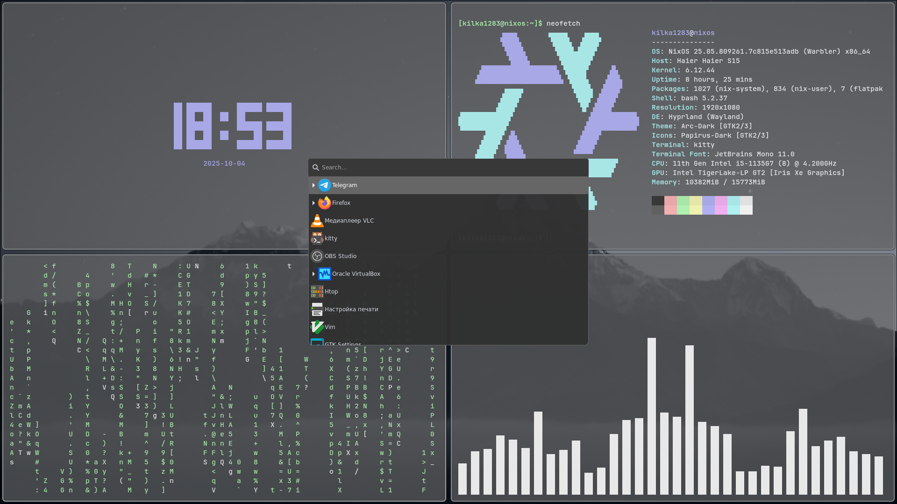
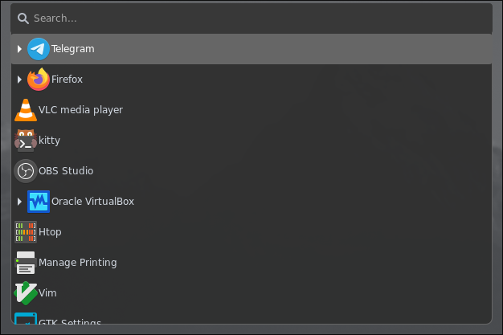

# My First Rice 🎨

Thank you for checking out my repository! This is my first rice configuration for my Linux desktop.

## What's Inside 🗂

### Configurations:

- Hyprland - Window manager config

- Kitty - Terminal emulator

- NixOS - System configuration

- Wofi  - Application launcher

## Wallpapers
- dark-bright-mountains.jpg - My current wallpaper

## Themes
- Arc Dark - GTK theme
- McMojave Cursors - Cursor theme

## ⚠️ Note
Sorry for the lack of installation guide right now - I'm still working on it! 
In the meantime, you can browse the config files to see the setup, or Google how to install each component.

For now, I can show you the results:

## Screenshots 📸

### Final Result

### Wofi Menu

Guide coming soon! 🔧
